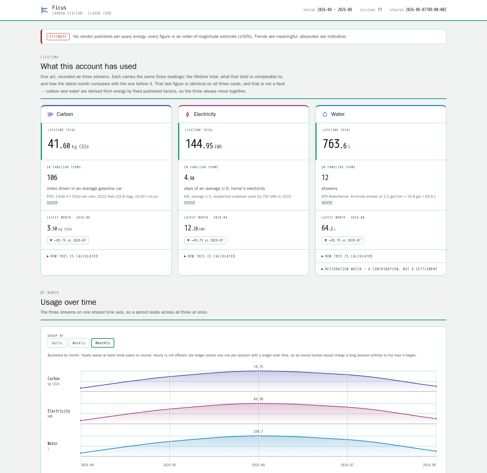

# Ficus

A local carbon ledger for Claude Code. It reads your session transcripts,
estimates the electricity, water and CO2e behind them, keeps the total in your
statusline, and records the offsets and donations you buy against it.

Everything runs on your machine. No network calls, no telemetry, no installer.



**[Live demo dashboard →](https://signalblur.github.io/ficus/)** (fabricated
data: fake sessions, fake purchases, fake receipt)

## Install

You need `bash`, `jq` and `sqlite3`. Nothing else, and there is nothing to add
to a package manager.

```bash
git clone https://github.com/signalblur/ficus.git
cd ficus
bash scripts/setup.sh
```

`setup.sh` checks those three dependencies, creates
`~/.claude/carbon-ledger/carbon.db`, writes `factors.env`, backfills whatever
transcripts are still on disk, and prints a hook block. Paste it into
`~/.claude/settings.json` and reload Claude Code:

```json
{
  "hooks": {
    "Stop": [{ "matcher": "", "hooks": [{ "type": "command", "command": "<repo>/scripts/persist-session.sh" }] }],
    "SessionStart": [{ "matcher": "", "hooks": [{ "type": "command", "command": "<repo>/scripts/safety-rescan.sh" }] }]
  }
}
```

For `/carbon`, `/carbon-offset` and `/carbon-review`, symlink the three skills:

```bash
ln -s "$PWD/skills/carbon/SKILL.md"        ~/.claude/commands/carbon.md
ln -s "$PWD/skills/carbon-offset/SKILL.md" ~/.claude/commands/carbon-offset.md
ln -s "$PWD/skills/carbon-review/SKILL.md" ~/.claude/commands/carbon-review.md
```

Each skill resolves the repo through `$CARBON_LEDGER_DIR`, so export that in
your shell profile pointing at your clone.

The statusline segment is opt-in and merges into your own
`~/.claude/statusline.sh`. [docs/statusline-segment.md](docs/statusline-segment.md)
walks through it; `statusline-snippet.sh` at the repo root is the reference
implementation.

State lives in `~/.claude/carbon-ledger/` (database, receipts, exports,
dashboards). `CARBON_LEDGER_DB` overrides the database path and everything else
is derived from it, which is how the tests run against throwaway sandboxes.

## Where the numbers come from

No vendor publishes per-query energy for a hosted model. Every figure in this
tool is an estimate carrying roughly **±50%** uncertainty. Trends and relative
comparisons hold up; absolute values are indicative, and none of it is fit for
regulatory reporting.

No script hardcodes a constant. They all live in `data/*.json` next to a
`_source` field, and these are the ones that matter:

| Constant | Value | Source recorded in `data/factors.json` |
| --- | --- | --- |
| CO2e per million tokens | 39 in / 826 out (Sonnet), scaled for the rest | Jegham et al. 2025, [arXiv:2505.09598](https://arxiv.org/abs/2505.09598). Opus is 2x Sonnet, Haiku 0.5x, Fable 2x Opus. |
| Grid carbon intensity | 0.287 gCO2e/Wh | AWS location-based intensity, same paper |
| PUE | 1.14 | AWS fleet, same paper |
| Water | 0.18 L/kWh on-site + 5.11 L/kWh off-site | AWS 2023 sustainability figure; WRI generation-water intensity via Li et al. |
| Embodied carbon | 44.1 gCO2e/kWh | 8xH100 server LCA (BoaviztAPI + Lees-Perasso), 3-year life at TDP |
| Cache-read energy | 0.08 of an input token | Engineering estimate, not a measurement. The widest single lever here, because cache reads are most of the tokens. |

Energy is not a second model. `energy_wh = co2_grams / 0.287` is an identity:
the CO2 factors are facility energy times grid intensity, so dividing recovers
the energy exactly. Water and embodied carbon derive from that same energy.
There is one estimate in the ledger, not four.

Full derivations, every constant with its date, and the uncertainty bands are in
[METHODOLOGY.md](METHODOLOGY.md).

## What the footprint actually lands on

Three things this tool counts, and one published measurement for each.

**Electricity.** US data centres used **176 TWh in 2023, 4.4% of all US
electricity**, up from 76 TWh (1.9%) in 2018, and are projected at 325 to 580
TWh (6.7% to 12.0%) by 2028. Berkeley Lab, [*2024 United States Data Center
Energy Usage Report*](https://escholarship.org/uc/item/32d6m0d1) (LBNL-2001637,
December 2024). Globally the IEA puts data centres at around 415 TWh in 2024,
about 1.5% of world electricity, roughly doubling to 950 TWh by 2030
([*Key Questions on Energy and AI*](https://www.iea.org/reports/key-questions-on-energy-and-ai),
April 2026).

**Water.** The same Berkeley Lab report puts direct US data centre water
consumption at **66 billion litres in 2023**, with hyperscale facilities alone
projected at 60 to 124 billion litres by 2028, and the indirect footprint from
generating their electricity at nearly 800 billion litres (4.52 L/kWh). Li et
al. found that training GPT-3 in Microsoft's US data centres **can directly
evaporate 700,000 litres of clean freshwater**, and project global AI demand at
4.2 to 6.6 billion cubic metres of withdrawal in 2027
([arXiv:2304.03271](https://arxiv.org/abs/2304.03271)).

**Wetlands and land.** At a Michigan EGLE hearing in June 2026 on a permit for a
Google data centre in Van Buren Township, a state environmental quality analyst
said the site would **permanently impact 13.55 acres of wetlands, need six
culverts in regulated streams, and fill and abandon 573 linear feet of stream**
([Planet Detroit, 17 June
2026](https://planetdetroit.org/2026/06/google-data-center-wetlands/)). Many
sites no longer need a federal permit at all: after the Supreme Court's 2023
*Sackett* decision, E&E News counted at least **26 data centres taking
streamlined nationwide permits since January 2024 and 27 sites with identified
wetlands or streams that now fall outside the Clean Water Act**
([E&E News by POLITICO, 8 July
2026](https://www.eenews.net/articles/the-time-consuming-permits-dozens-of-data-centers-are-skipping/)).

## Where the money goes

Seven organisations, from the research in
`data/giving-shortlist.json`. The split that matters is between carbon that has
verifiably been taken out of the air and everything else. Only the first
settles the balance the statusline shows.

**Settles the balance**

**[Remove Carbon Today](https://www.removecarbontoday.com/collections)** ·
biochar CORCs · ≈ $160/tonne. Ex-post removal certificates issued under the Puro
Standard: the biochar is independently weighed and sampled, third-party audited,
and the certificate retired in your name on a public registry. Puro does not
sell direct, so a reseller is the small-buyer route, and the minimum here is 1
kg. The Nasdaq CORCCHAR index sat around $125–145/t through late 2025 into 2026,
with broader quotes at $200–400/t, so treat $160 as ±40%.

**Prevents a future emission, and is recorded separately**

**[Tradewater](https://tradewater.co/buy-credits/)** · refrigerant destruction ·
$15/tonne stated. Collects and destroys ozone-depleting refrigerants and plugs
orphaned methane wells. Every container is third-party weighed, sampled and
lab-analysed, destruction runs to better than 99.99% completion, and the credits
are ACR- or VCS-certified. It stops an emission rather than removing one, so it
never folds into the balance. The $15 could not be independently confirmed; the
nearest public comparable, Recoolit, sells around $75/t.

**Funded from a conservation budget, not the carbon ledger**

**[Naturaland Trust](https://naturalandtrust.org/donate-now)** · Blue Ridge
escarpment. Buys escarpment land above Greenville, 1,090 acres at Saluda Bluffs
for about $9M, inside the watershed feeding Greenville Water's own reservoirs.
It is the one organisation here where a rough $/tonne can be built from public
data, and the honest answer is a $20–150 band, because the choice of method
alone swings it five- to eightfold. Chosen for the drinking water as much as the
carbon.

**[Congaree Land Trust](https://congareelt.org/donate)** · COWASEE basin. Holds
easements across 25,398 acres around Congaree National Park, the largest
old-growth bottomland hardwood forest in the eastern United States. Floodplain
forested wetlands hold 176.6 ± 84 MgC/ha in the top metre, several times the
upland figure. The easements are donated rather than bought, so there is no
transaction to divide that stock by and no defensible price per tonne.

**[American Rivers](https://www.americanrivers.org/donate)** · dam removal.
Reservoir surfaces are a large methane source, an estimated 0.8 Pg CO2-eq a year
globally, and a CARB-hosted 2026 report puts the four removed Klamath dams at
roughly 275,000 tonnes CO2e a year eliminated. The avoidance is real for
specific dams. A donation still cannot be converted into tonnes: American Rivers
is one partner among many funders and sells no credit.

**[Billion Oyster Project](https://www.billionoysterproject.org/donate)** · New
York Harbor. About 150 million oysters across 17 acres as of December 2025, at
roughly $250,000 an acre, with a public-schools programme attached. Funded for
the harbour: habitat, storm-surge buffering, filtration, and the students. There
is no BOP carbon accounting to cite and the reef-chemistry literature does not
support one, so nothing here touches the ledger.

**[Coral Restoration Foundation](https://coralrestoration.org/donate)** ·
Florida Keys. Propagates and outplants staghorn coral. A Florida study found
that high-density outplanting restores positive net carbonate accretion on reefs
that had gone erosional, which is reef structure rebuilt rather than atmospheric
carbon removed. Florida's reefs carry a documented $1.8B flood-protection value.
Funded for the reef, the coastline and the biodiversity.

The dashboard carries the full per-organisation detail, including the evidence
that argues against the carbon case for several of them.

## Credit

Ficus is a hardened fork of
[claude-carbon](https://github.com/gwittebolle/claude-carbon) by Gaëtan
Wittebolle (MIT), pinned at commit
`43fb883ac1989d962c8699afb0be37fbe69c4476` (tag `upstream-43fb883`) after a
line-by-line audit.

Kept from upstream: the transcript parser, the throttled backfill, the SQLite
ledger of raw tokens, the Jegham-derived factors and price tracking, and the
golden-vector tests. Deleted: the statusline script that read the OAuth token
and called `api.anthropic.com`, the pipe-to-shell and `npx` installers, the
auto-update surface, and the templates that loaded webfonts.
`tests/run-hygiene.sh` holds the line at zero network call sites in `scripts/`,
`hooks/` and `skills/`.

Added by the fork: the derived energy, water and embodied-carbon columns, the
offsets and donations ledger with receipt storage, the tax-year export, the
dashboard, the statusline segment, the EcoLogits cross-check, and most of the
tests. [MAINTENANCE.md](MAINTENANCE.md) has the cherry-pick procedure and the
constants provenance table.

## Tests

```bash
bash tests/run-tests.sh
```

Ten suites, every one against a sandbox database, none of them touching the
network or your real `~/.claude`.

## License

MIT. Upstream copyright Gaëtan Wittebolle, fork modifications copyright
signalblur. Third-party material bundled here, including the seven US federal
public-domain photographs in the dashboard, is inventoried in
[NOTICE.md](NOTICE.md). See [LICENSE](LICENSE).
